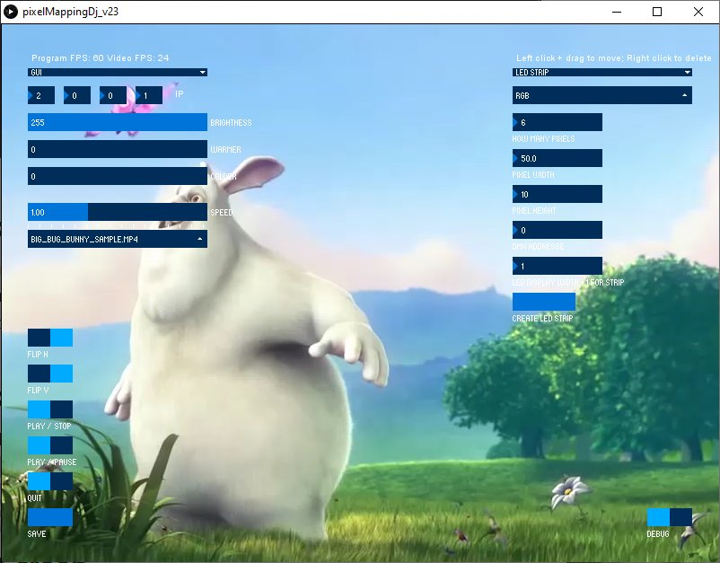

# PixelMappingDj
Control lights with video, no programming needed. Runs on Windows, Linux, iOS and Raspberry Pi!

Hi,
let me introduce new open source software for light designers I have programmed - PixelMappingDj that I would love to see used in your project.  

PixelMappingDJ is **open source** software for Pixel Mapping - **controlling light fixtures** (think led strips, dmx lights..) **with video**. That means **you do not have to program anything** - you only need to be able to edit video or use existing one to create infinite number of effects. It was completely programmed using [**Processing**](https://processing.org/ "Processing") Java so you can easily modify it. It uses [**Artnet**](https://github.com/cansik/artnet4j "Artnet") for communication, [**ControlP5**](http://www.sojamo.de/libraries/controlP5/ "ControlP5") for GUI and [**GL Video**](https://github.com/gohai/processing-glvideo "GLVideo") and [**Video**](http://processing.org/reference/libraries/video/index.html "Video") libraries. It runs on **Windows, Linux, iOS and Raspberry Pi** where it uses hardware acceleration.

Similar software (Madrix, Resolume Arena to name a few) usually costs lots of money, it needs particular platform to run on and it is proprietary, which can become a problem when you have custom lights that does not fit in the predefined fixture pattern. 

# Support
I am **offering custom paid support** and modifications to software to suit your needs if you do not want to do it yourself - send me email at

You can also post feature request here on Github but I can not guarantee if and when it will be implemented. On the other hand all **contributions from community are welcomed** and appreciated. If you program additional feature worth publishing do not hesitate to contact me so I can add it in the repository. 

## HOW TO INSTALL
Simply download folder for your OS from Builds:

[**Windows64.7zip**](https://github.com/trackme518/PixelMappingDj/raw/master/BUILDS/application.windows64.7z "WindowsBuild_v23")

Extract the file once downloaded. Go inside the folder, double click "pixelMappingDj.exe". Wait a few seconds for the program to load, when asked enable acces to networks - both private and public. Other OS builds are coming soon - in the meantime you can [build it on your own](https://github.com/processing/processing/wiki/Export-Info-and-Tips "buildApp").

## DONATE TO HELP DEVELOP PixelMappingDj FOR FREE

Donate in **EUR**: 

Donate in **USD**: 

Donate in **CZK**: 

FEATURES |
------------ |
Control video speed - from 0.5 to 2.0* speed |
Control video color temperature | 
Create and save custom light fixtures - support for RGB, W, RGBW, RGBWWW | 
Disable GUI to boost performance | 
Flip video | 
IP unicast | 
set custom DMX addresse | 

